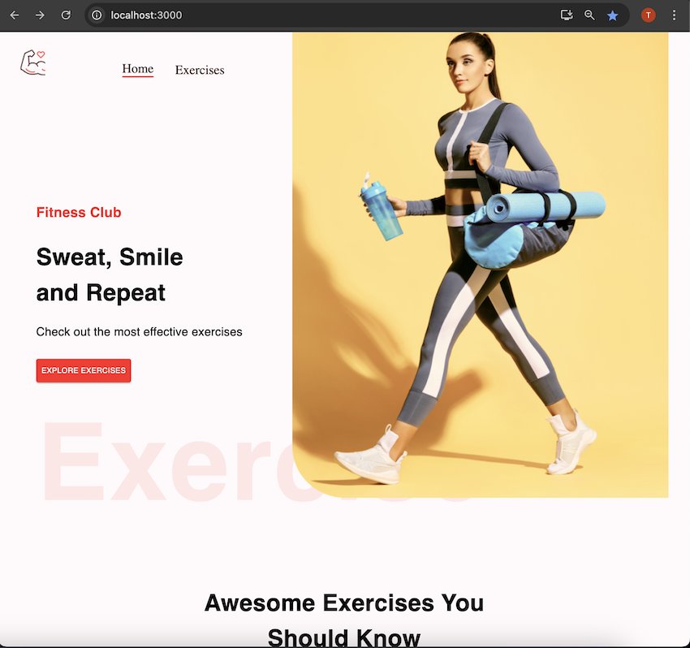
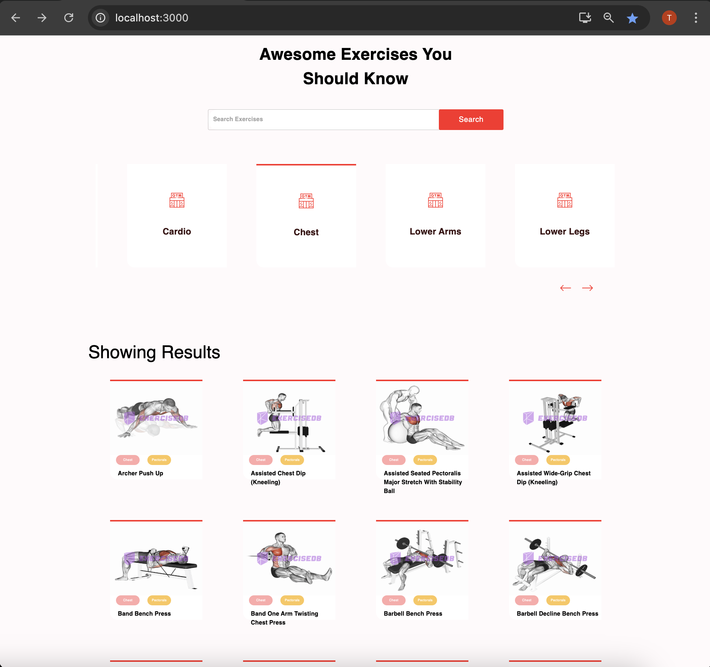
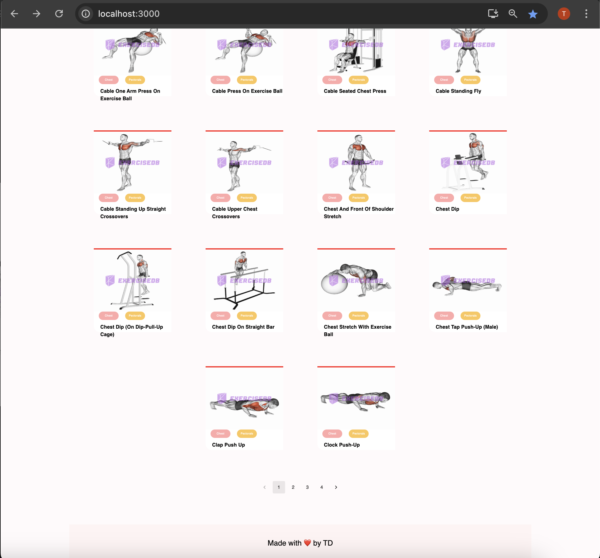
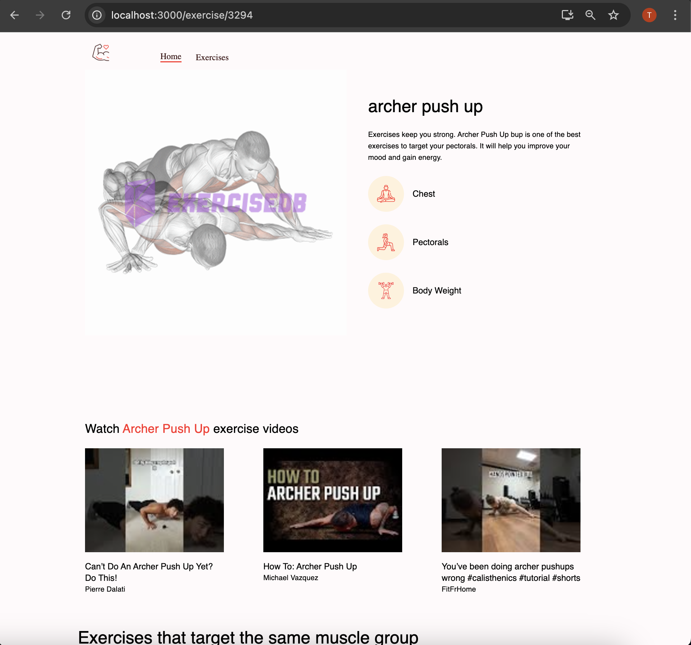
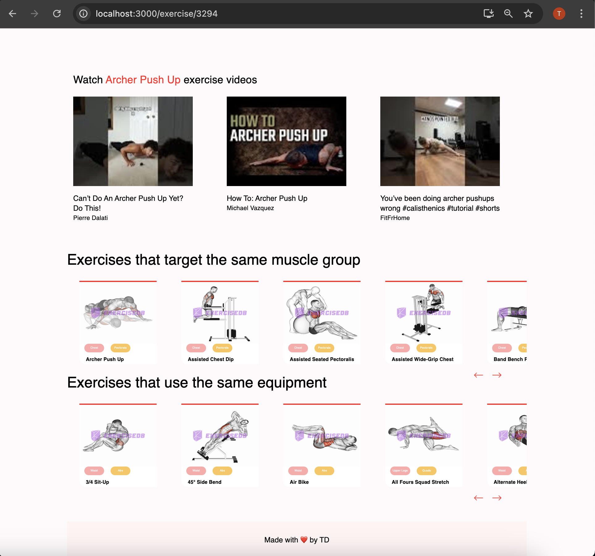

### Live Demo

https://td-gym-exercises-app.netlify.app/


# Links
 - [Firebase-Console]()

# Setup

- Install [Node](https://nodejs.org/en/download/)
- Install [Git](https://git-scm.com/book/en/v2/Getting-Started-Installing-Git)
- Clone the repository `https://github.com/tddag/gym_exercises_app`
- Install dependencies `npm install --legacy-peer-deps`
- Set up Youtube API:
  - [Google Console](https://console.cloud.google) > Youtube Data API > Credentials > API key
- Set up Rapid API
- Set up Firebase Storage
  - Update Storage Access as required - Firebase -> Storage -> Rules:
  ```
      rules_version = '2';
      service firebase.storage {
      match /b/{bucket}/o {
          match /{allPaths=**} {
          allow read, write: if
              request.time < timestamp.date(2024, 5, 23);
          }
      }
      }
  ```
- Setup environment variables:
  - <table>
        <tr>
            <th>Variable</th>
            <th>Value</th>
            <th>Description</th>
        </tr>
        <tr>
            <td>REACT_APP_RAPID_API_KEY</td>
            <td>2e5d95953c.....</td>
            <td>Rapid API Key</td>
        </tr>   
        <tr>
            <td>REACT_APP_YOUTUBE_API_KEY</td>
            <td>AIzaSyA....</td>
            <td>Google Youtube API Key</td>
        </tr>                                           
    </table>
- Run the application `npm run start`

# Functionalities

- Exercises listing, Search by exercise name, Filter exercise by category
    <table>
        <tr>
            <td></td>
            <td></td>
            <td></td>
        </tr>
    </table>
- Exercise Details, Youtube videos, Exercises target same muscle group
    <table>
        <tr>
            <td></td>
            <td></td>
        </tr>
    </table>

# Technologies/Libraries

- React: Web library
- MaterialUI: React Component library
- React-horizontal-scrolling-menu: Horizontal Scrolling
- react-loader-spinner: Spinner
- GoogleDeveloperConsole > YoutubeAPI: Youtube API to get video details
- Rapid API: API Hub
- Firebase Storage: File Storage

# Install dependencies

### npm install --legacy-peer-deps


# Deploy to VPS
 - fix dependency errors:
    - update "package.json", change     "react-loader-spinner": "^6.0.0" to "react-loader-spinner": "^7.0.2",
 - run python script to upload gif files to Cloudinary
 - update "./src/data/exercisesData.js"
    - point url from Firebase Storage to Cloudinary
    - For example:
        - From:
            https://firebasestorage.googleapis.com/v0/b/chatappfirebasetd.appspot.com/o/exercises%2FTMAuOnp5xDP5d1.gif?alt=media
        - To:
            https://res.cloudinary.com/dysns4al9/image/upload/v1779592720/gifs/TMAuOnp5xDP5d1.gif
- Dockerize React App
    - Create "Dockerfile"
    - create Docker image
        `docker build -t 2023_0419_frontend_gym_exercise_app_react .`
    - run container:
        `docker run -d -p 3002:80 2023_0419_frontend_gym_exercise_app_react` 
    - test:
        GET "http://localhost:3002/"
    - push to Docker Hub
        - login
            `docker login`
        - tag image
            `docker tag 2023_0419_frontend_gym_exercise_app_react tddag/2023_0419_frontend_gym_exercise_app_react`
        - push image
            `docker push tddag/2023_0419_frontend_gym_exercise_app_react`
    - log in to VPS
        `ssh root@178.105.136.113`
    - pull image
        `docker pull tddag/2023_0419_frontend_gym_exercise_app_react`
    - run container 
        `docker run -d -p 3002:80 tddag/2023_0419_frontend_gym_exercise_app_react`
    - test 
        - GET "http://178.105.136.113:3002/"          


---

# Getting Started with Create React App

This project was bootstrapped with [Create React App](https://github.com/facebook/create-react-app).

## Available Scripts

In the project directory, you can run:

### `npm start`

Runs the app in the development mode.\
Open [http://localhost:3000](http://localhost:3000) to view it in your browser.

The page will reload when you make changes.\
You may also see any lint errors in the console.

### `npm test`

Launches the test runner in the interactive watch mode.\
See the section about [running tests](https://facebook.github.io/create-react-app/docs/running-tests) for more information.

### `npm run build`

Builds the app for production to the `build` folder.\
It correctly bundles React in production mode and optimizes the build for the best performance.

The build is minified and the filenames include the hashes.\
Your app is ready to be deployed!

See the section about [deployment](https://facebook.github.io/create-react-app/docs/deployment) for more information.

### `npm run eject`

**Note: this is a one-way operation. Once you `eject`, you can't go back!**

If you aren't satisfied with the build tool and configuration choices, you can `eject` at any time. This command will remove the single build dependency from your project.

Instead, it will copy all the configuration files and the transitive dependencies (webpack, Babel, ESLint, etc) right into your project so you have full control over them. All of the commands except `eject` will still work, but they will point to the copied scripts so you can tweak them. At this point you're on your own.

You don't have to ever use `eject`. The curated feature set is suitable for small and middle deployments, and you shouldn't feel obligated to use this feature. However we understand that this tool wouldn't be useful if you couldn't customize it when you are ready for it.

## Learn More

You can learn more in the [Create React App documentation](https://facebook.github.io/create-react-app/docs/getting-started).

To learn React, check out the [React documentation](https://reactjs.org/).

### Code Splitting

This section has moved here: [https://facebook.github.io/create-react-app/docs/code-splitting](https://facebook.github.io/create-react-app/docs/code-splitting)

### Analyzing the Bundle Size

This section has moved here: [https://facebook.github.io/create-react-app/docs/analyzing-the-bundle-size](https://facebook.github.io/create-react-app/docs/analyzing-the-bundle-size)

### Making a Progressive Web App

This section has moved here: [https://facebook.github.io/create-react-app/docs/making-a-progressive-web-app](https://facebook.github.io/create-react-app/docs/making-a-progressive-web-app)

### Advanced Configuration

This section has moved here: [https://facebook.github.io/create-react-app/docs/advanced-configuration](https://facebook.github.io/create-react-app/docs/advanced-configuration)

### Deployment

This section has moved here: [https://facebook.github.io/create-react-app/docs/deployment](https://facebook.github.io/create-react-app/docs/deployment)

### `npm run build` fails to minify

This section has moved here: [https://facebook.github.io/create-react-app/docs/troubleshooting#npm-run-build-fails-to-minify](https://facebook.github.io/create-react-app/docs/troubleshooting#npm-run-build-fails-to-minify)
